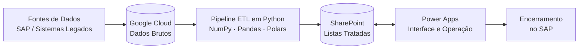

# Aplicativo de Gestão de Chamados – TUR

> Solução integrada para priorização e gerenciamento de notas de manutenção e atendimento por turno.


---

## Nota de Confidencialidade e Restrição de Código

> **Atenção:** este repositório possui finalidade exclusivamente documental e de apresentação da arquitetura do projeto.

O **Aplicativo de Gestão de Chamados – TUR** foi desenvolvido como uma solução corporativa interna.

Devido a acordos de confidencialidade (NDA), políticas de governança e proteção de propriedade intelectual, os seguintes componentes **não estão disponíveis neste repositório**:

- Código-fonte completo da aplicação corporativa;
- Dados reais ou dados de teste;
- Credenciais e segredos;
- Scripts internos de ETL;
- Arquivos de configuração sensíveis;
- Informações proprietárias dos sistemas corporativos.

O conteúdo disponibilizado tem como objetivo demonstrar **arquitetura, tecnologias utilizadas, fluxo de dados e conceitos técnicos** empregados na solução.

---

## Sobre o Projeto

O **Aplicativo de Gestão de Chamados – TUR** foi desenvolvido para centralizar, organizar e priorizar as notas de manutenção e atendimento operacional de cada turno.

A solução integra informações provenientes do **SAP e de sistemas legados**, processa os dados por meio de um pipeline desenvolvido em **Python** e disponibiliza as informações tratadas em uma interface operacional construída com **Microsoft Power Apps**.

O objetivo principal é proporcionar à coordenação uma **visão única da fila de atendimento**, permitindo que as demandas sejam classificadas de acordo com critérios de criticidade e acompanhadas até sua conclusão.

---

## Desafios Resolvidos

### Visão Unificada

Consolidação das notas provenientes do SAP e de sistemas legados em uma única fila operacional.

### Priorização

Aplicação de critérios de criticidade para ordenar dinamicamente as demandas de manutenção.

### Rastreabilidade

Registro das alterações de status, priorizações e notas concluídas, permitindo maior controle sobre o histórico operacional.

### Agilidade na Tomada de Decisão

Disponibilização de informações organizadas em uma única interface, reduzindo a necessidade de consultar diferentes ferramentas.

---

## Objetivos

| # | Objetivo | Descrição |
|---|---|---|
| 1 | **Priorização inteligente** | Classificar as notas de acordo com seu nível de criticidade. |
| 2 | **Integração de dados** | Consolidar informações provenientes de diferentes sistemas em uma única solução. |
| 3 | **Visibilidade operacional** | Disponibilizar uma fila única de atendimento para a coordenação. |
| 4 | **Rastreabilidade** | Registrar alterações e notas concluídas ao longo do processo. |
| 5 | **Agilidade** | Apoiar decisões operacionais com critérios claros e objetivos. |

---

## Arquitetura da Solução



### Visão das Camadas

| Camada | Responsabilidade |
|---|---|
| **Google Cloud** | Armazenamento e disponibilização dos dados brutos para processamento. |
| **Python** | Extração, limpeza, transformação, enriquecimento e cálculo da criticidade. |
| **SharePoint** | Armazenamento dos dados tratados e integração com o Power Apps. |
| **Power Apps** | Interface operacional para consulta, priorização e acompanhamento das notas. |
| **SAP** | Sistema de origem e encerramento das notas de manutenção. |

A arquitetura foi organizada de forma modular, permitindo que cada camada evolua de maneira independente, reduzindo o acoplamento entre processamento, armazenamento e interface.

---

## Fluxo de Dados

O pipeline segue as seguintes etapas:

```text
SAP / Sistemas Legados
        │
        ▼
   Google Cloud
        │
        ▼
      Python
        │
        ├── Extração
        ├── Limpeza
        ├── Enriquecimento
        └── Priorização
        │
        ▼
    SharePoint
        │
        ▼
    Power Apps
        │
        ▼
 Operação / Coordenação
        │
        ▼
 Encerramento no SAP
```

---

## Fluxo Operacional

1. A **nota de manutenção** é registrada no sistema de origem.
2. Os dados são disponibilizados para processamento.
3. O **pipeline Python** realiza a extração e tratamento dos dados.
4. As notas são enriquecidas e classificadas de acordo com os critérios definidos.
5. Os dados tratados são publicados no **SharePoint**.
6. O **Power Apps** apresenta a fila priorizada.
7. A **coordenação** analisa e, quando necessário, ajusta a criticidade.
8. A **manutenção** executa o serviço.
9. A nota é encerrada no **SAP**.
10. O aplicativo registra a conclusão para consulta histórica.

---

## Critérios de Priorização

As notas são classificadas de acordo com seu nível de criticidade.

| Nível | Indicador | Significado |
|---|---|---|
| **Alta** | 🔴 Vermelho | Demanda atuação imediata ou prioridade elevada. |
| **Média** | 🟡 Amarelo | Deve ser tratada dentro do planejamento do turno. |
| **Baixa** | 🔵 Azul | Pode aguardar uma janela adequada de manutenção. |

A coordenação pode ajustar o nível de criticidade diretamente no aplicativo, de acordo com as regras operacionais estabelecidas.

> **Observação:** as regras, pesos e parâmetros de priorização são específicos do ambiente corporativo e não são disponibilizados publicamente neste repositório.

---

## Pipeline de Dados

O processamento é estruturado em cinco etapas principais:

| Etapa | Descrição |
|---|---|
| **Extrair** | Leitura dos dados disponibilizados no ambiente de origem. |
| **Limpar** | Padronização de campos e tratamento de inconsistências. |
| **Enriquecer** | Cruzamento das notas com informações complementares. |
| **Pontuar** | Aplicação das regras de criticidade e priorização. |
| **Publicar** | Disponibilização dos dados tratados no SharePoint. |

O processamento utiliza Python e bibliotecas voltadas para manipulação e análise de dados.

---

## Stack Tecnológica

### Dados e Processamento

- **Python 3.10+**
- **NumPy**
- **Pandas**
- **Polars**

### Cloud

- **Google Cloud Platform (GCP)**
- Serviços de armazenamento e processamento de dados utilizados conforme a arquitetura corporativa.

### Armazenamento e Integração

- **Microsoft SharePoint**
- Listas utilizadas como camada de dados para a aplicação.

### Aplicação

- **Microsoft Power Apps**
- Aplicativo Canvas integrado ao SharePoint.

### Sistemas Corporativos

- **SAP**
- Sistemas legados utilizados como fontes de informação operacional.

---

## Segurança e Governança

A solução considera princípios de segurança e governança em todas as etapas do fluxo de dados.

### Controle de Acesso

- Controle de acesso aos recursos do Google Cloud por IAM;
- Princípio do menor privilégio;
- Controle de permissões no SharePoint;
- Controle de acesso ao Power Apps conforme perfil de usuário.

### Proteção de Credenciais

Credenciais, tokens, chaves e informações sensíveis **não devem ser armazenados no código-fonte ou versionados no Git**.

Arquivos contendo informações sensíveis devem permanecer fora do repositório público.

### Rastreabilidade

A solução permite registrar informações relacionadas à operação, como:

- Alterações de prioridade;
- Alterações de status;
- Usuário responsável pela ação;
- Data e horário das alterações;
- Notas concluídas.

---

## Qualidade dos Dados

Antes da publicação no SharePoint, os dados passam por etapas de tratamento e validação.

O pipeline busca garantir:

- Padronização dos campos;
- Tratamento de valores inconsistentes;
- Controle de duplicidades;
- Validação das informações necessárias;
- Consistência dos dados publicados.

Essa abordagem reduz a possibilidade de informações inconsistentes chegarem à camada de operação.


## Status do Projeto

**Status:** ✅ Concluído

O projeto foi desenvolvido como uma solução corporativa interna para apoiar o gerenciamento e a priorização das notas de manutenção por turno.

Este repositório apresenta a **arquitetura, fluxo de dados, tecnologias e conceitos utilizados**, sem disponibilizar componentes proprietários ou informações confidenciais.

---

## Responsáveis

**Equipe responsável:** Confiabilidade e Processos

**Responsáveis técnicos:**  
Ryan Piége · Luiz Araujo

---

## Confidencialidade

> Projeto desenvolvido para uso interno da **Suzano**.
>
> As informações apresentadas neste documento possuem finalidade técnica e de portfólio. Dados, credenciais, informações operacionais sensíveis, código proprietário e detalhes internos dos sistemas corporativos não são disponibilizados neste repositório.

---

## Licença

Este projeto não possui licença de código aberto.

O conteúdo disponibilizado neste repositório é destinado exclusivamente à documentação e apresentação da arquitetura da solução.
